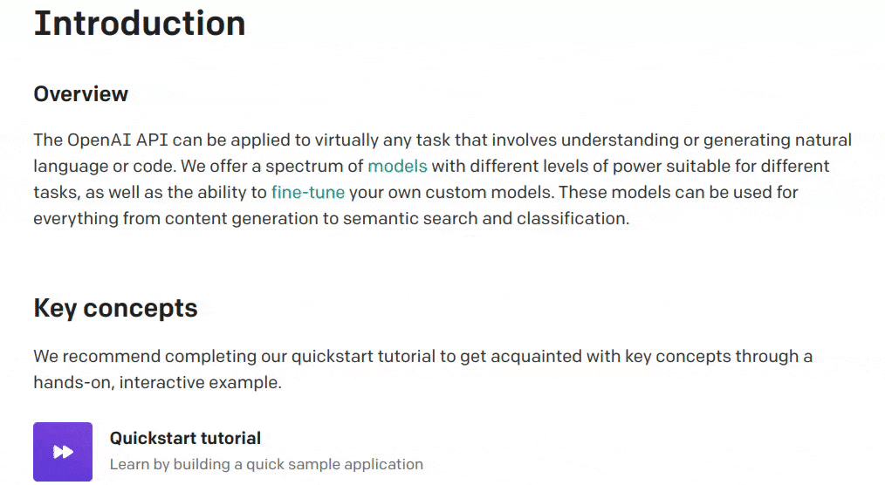

# 介绍

## 使用演示

## 名字来源
### pot(Translator for Pylogmon | 派了个萌的翻译器)
> 不用top是因为已经有知名linux软件占用了`top`这个名字
> 所以现在你也可以叫他翻译锅😂

## 支持平台

|   |Linux|Windows|MacOS|
| - |-----|-------|-----|
|划词翻译|✅| | |
|独立窗口|✅|✅|✅|

## 支持接口
- 有道翻译(无需申请)
- ChatGPT(需要申请[API服务](/guide/api/chatgpt.html) 0.002$/1000token)
- 百度翻译(需要申请[API服务](/guide/api/baidu.html) 每月免费额度100万字符)
- 彩云小译(需要申请[API服务](/guide/api/caiyun.html) 每月免费额度100万字符)
- 持续更新中...

> 由于使用api产生的费用本作者概不负责
